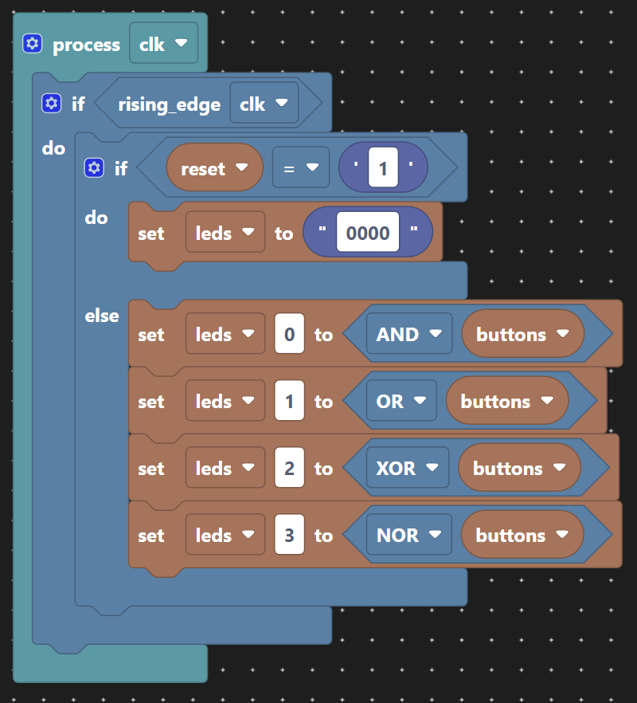
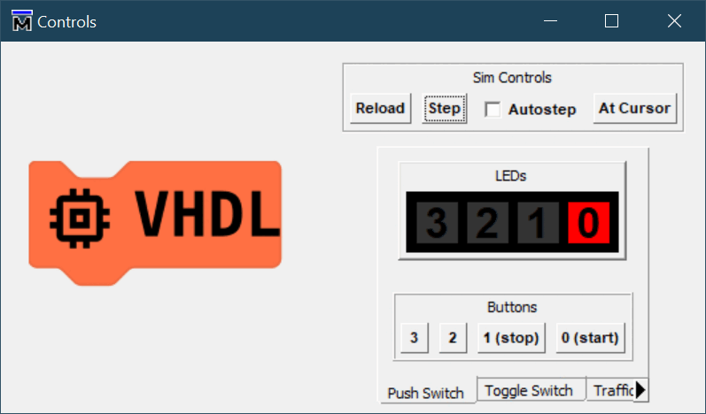
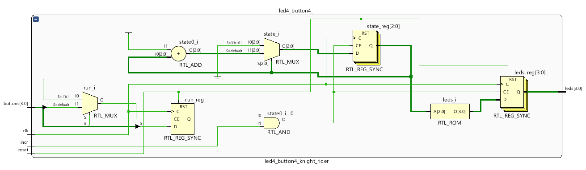
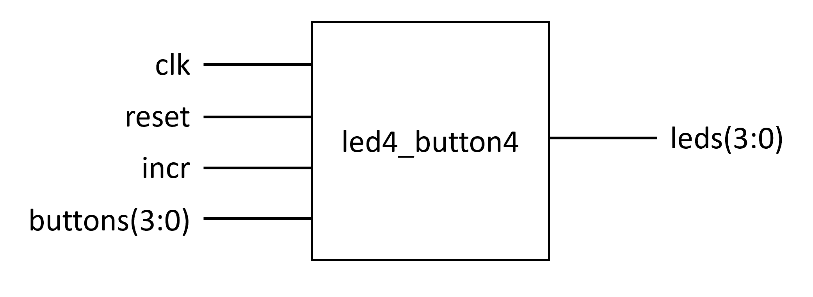

# Scratch VHDL

[](https://github.com/google/blockly)
[](https://open-vsx.org/extension/JosephAbbey/scratch-vhdl-vscode)
[](https://open-vsx.org/extension/JosephAbbey/scratch-vhdl-vscode)

The purpose of "Scratch VHDL" is to make reprogrammable logic design into child's play. Sounds ambitious. We'll do this by providing an introductory package of measures to simplify all aspects of design entry from coding through to deployment on a *"Field Programmable Gate Array"* (reprogrammable silicon chip). We'll simplify the process into the following step:

1. Using a *Scratch* interface to enable drag and drop coding of VHDL.
2. Providing simple examples to code on a basic theme of 4 button and 4 LEDs, thereby...
3. Reducing the range of VHDL being used to a subset that can still be interesting and provide a learning experience.
4. Making testing interactive through a graphical control panel composed of buttons and LEDs to drive stimulus for the functional simulation instead of writing a VHDL test bench.
5. Using the native FPGA design tools in a guided point & click mode.
6. Encourage the understanding of the synthesis results by clicking through from gates to code.
7. Reducing the clock speed so that timing closure can be ignored.
8. Downloading the design to a development board in order to test for real, in a similar style to the interactive test bench used for simulation.

For example, we can create this Scratch diagram on the left using our VS Code plug-in, and VS Code will generate the VHDL on the right.

<div style="column-count:2">


```vhdl
architecture scratch of logic_gates is
begin

  process(clk)
  begin
    if rising_edge(clk) then
      if reset = '1' then
        leds <= "0000";
      else
        leds(0) <= and(buttons);
        leds(1) <= or(buttons);
        leds(2) <= xor(buttons);
        leds(3) <= nor(buttons);
      end if;
    end if;
  end process;

end architecture;
```
</div>

All of these measures allow the design entry process to be simplified to a practical guided lesson. The content of what can be done with four buttons and 4 LEDs can then be tailored from fundamental combinatorial gates through to basic sequences of states with more involved combinatorial logic demands. Anyone new to FPGA design will be able to experience the design process to realise and test a real (if simple) design, and gain an education.
## Design Entry

Rather than hiding the code from the students, the Scratch project builder engages its audience with its creation, allowing them to experience a modern design entry method. Scratch will reduce the chances of syntax errors (but not completely eliminate them), and a standard project setup can be used to avoid many of the time consuming distractions. For example, we use a standard VHDL `entity` for all the demonstration designs, and the Scratch builder only has to assist with the derivation of the VHDL `architecture` in a single file.

Once the Scratch design compiles, it can be tested in a VHDL simulator with the following point & click graphical controls.



Variations on the controls are placed in different tabs.

1. Push buttons that immediately release, with 4 red LEDs.
2. Toggle buttons that have to be clicked to release, with 4 red LEDs.
3. Traffic light LEDs with push buttons.

The buttons will control the inputs to the top level entity, and the LED outputs from the VHDL simulator will drive the LED graphics. With the "Autostep" simulator control, the VHDL simulator becomes the chip, and no test bench code needs to be written. A free version of ModelSim is used for this purpose, where the limitations do not constrain the required functions.

The controls are used as a substitute for writing a full VHDL test bench. This is what the simulation looks like.


Scripts are then used to automate the production of the bit file and sending it to the development board for testing. The scripts show the intermediate products, and the picture below shows the elaboration of the design to generic gates.



The chosen FPGA development board is a [Zybo Z7](https://digilent.com/reference/programmable-logic/zybo-z7/start) (Zynq-7010 variant). But as the subset of functionality is small, many other boards will be suitable too, for the sake of modifying the outer level VHDL.


Below is a video of a pseudo-random sequence generated by [one of the demonstrations](lfsr.md).

<video width="320" height="320" controls>
  <source src="./images/lfsr_internal.mp4" type="video/mp4">
</video>

Vivado Webpack is used for synthesis, place and route as we are staying within the devices supported by this free version. The source code includes input, output, constraints and pin out required to interface to the design, and these details are hidden from immediate view.

The download to the development board is managed through TCL scripts so the authors can immediately start trying their design out for real.

## Demonstration Designs

Demonstration designs are provided in order of incremental difficulty (in the main). They are designed to introduce digital design concepts a step at a time. Each one fits within the following interface design so that the contents can be changed without changing how we perform both simulation and synthesis.



| Signal         | Description|
| -------------- | ---------- |
| `clk`          | A 125 MHz clock, i.e. 8 ns period. |
| `reset`        | A pulse generated once just after programming the FPGA intended to bring the memory elements to a known state.|
| `incr`         | A pulsed every few clocks to slow down the update of the display. In simulation this is every 10 clocks, in real life this is every 0.5s. |
| `buttons(3:0)` | The four push buttons, or four toggle buttons from the development board. Each element of `buttons` is driven by both a push button and a toggle button OR'ed together. Therefore the corresponding switch must be held low ('0') for the push button to operate correctly. |
| `leds(3:0)`    | The four LEDs on the development board. |

### Example Demonstrations

1. **[One LED per button](button_driven.md)**, can we get the board to work?
2. **[Logic gates](logic_gates.md)**, 4 logic functions of four inputs driving an LED each. Combine this with drawings of truth tables to bring the tables to life.
3. **[Pulse Generator](pulse_generator.md)**, shortening a long pulse to a short one.
4. **[Shift Register](shift_registers.md)**, use a button to choose the status of LED 0, all the LEDs continue to scroll to the left. This can be developed into sequences that go back and forth for a bi-directional shift register controlled by two buttons, each inserting a lit LED into one end and changing the direction of shift.
5. **4-bit [binary counter](binary_counter.md)** with start and stop buttons.
6. **[Sum of buttons pressed](adders.md)**. This come in two variations, one-hot and binary. The former lights a single LED based on the number of buttons pressed at any one time. The latter represent the number of buttons in binary 0-4.
7. The **[Knight Rider](knight_rider.md) KITT car** bonnet light sequence from the 1980's television series.
8. **[Traffic lights](traffic_lights.md)** come in two variations; the standard junction and the Pelicon crossing. The latter (of course) includes a flashing yellow stage.
  
9. **[Linear Feedback Shift Register](lfsr.md)** in two variations, internal and external feedback. This is included for something more taxing for the more capable student.

The desire is to combine a discussion of the theory with the practical via engagement with interactive tools. Each of the demonstration designs above has their own description page.

## Fuller Details

These are split into separate pages as follows:

* Installation
  * Scratch VHDL
  * ModelSim
  * Vivado
  * Visual Studio Code, including:
    * Scratch VHDL plugin
    * VHDL editor plugin (VHDL LS)
* Editing with Scratch VHDL
  * Drag and droop of block to create VHDL code
  * Compilation of VHDL code
* Simulation of VHDL
  * Verification using the simulator to emulate the design interactively
* Synthesis of VHDL
  * Elaboration to see the recognisable (generic) gates inferred by the VHDL
  * Synthesis to map the generic gates to the required FPGA device
  * "Place & Route" the design across the FPGA fabric
* Execution on the target development board
  * Bit file generation and programming of the FPGA on the development board over USB
  * Verification on the development board
