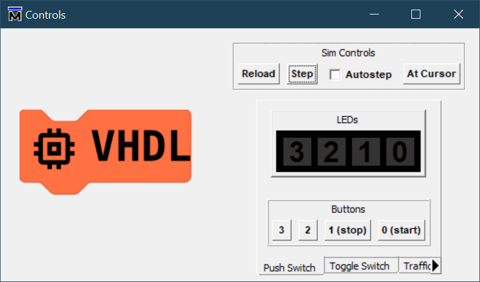

# Binary Counter

The code uses an integer, a conversion function then creates the 4-bit binary value to be displayed. The integer's value needs to be constrained to the range 0..15 and the counter roll-over managed. What happens if the count range is unconstrained, even if the roll-over value is managed correctly? Two buttons operate `start` and `stop`.

No its not rocket science, some people may not be familiar. It could prove a useful revision for some of the later demonstrations.

## Decimal to Binary Conversion Table.

| Decimal | Hexadecimal | Binary |
|:-------:|:-----------:|:------:|
|    0    |      0      |  0000  |
|    1    |      1      |  0001  |
|    2    |      2      |  0010  |
|    3    |      3      |  0011  |
|    4    |      4      |  0100  |
|    5    |      5      |  0101  |
|    6    |      6      |  0110  |
|    7    |      7      |  0111  |
|    8    |      8      |  1000  |
|    9    |      9      |  1001  |
|   10    |      A      |  1010  |
|   11    |      B      |  1011  |
|   12    |      C      |  1101  |
|   13    |      D      |  1101  |
|   14    |      E      |  1110  |
|   15    |      F      |  1111  |

NB. Hexadecimal is just a way of writing groups of 4 binary bits, and is easier to read by comparison with very long binary values. You may have seen them used in Network cards for the _Ethernet MAC Address_ or in checksums (e.g. CRC32).
