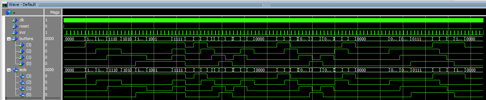
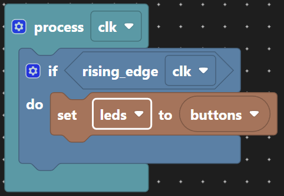

# Buttons Driven LEDs

Very much the "Hello World!" application to make sure the end-to-end design flow works from code entry to testing the design on a development board.

Each toggle button lights a corresponding LED. That's it. This design introduces the Scratch VHDL method of design entry using an assignment in a clocked process. This means that each button is registered before driving an LED. This works with both push and toggle buttons in the controller.

An extension is to maintain the last selected push button after it is released. This amendment is more suitable to the push buttons as it means it is no longer possible to turn off all the LEDs with toggle buttons.

Above, the wave traces for the LEDs mirror those of the buttons.

## Implementation

You could just:

<pre>
<code class="language-vhdl">
architecture scratch of logic_gates is
begin

  leds <= buttons;

end architecture;
</code>
</pre>

Except that's just a 'wire' and not terribly exciting. Instead you could register (some might say "latch", but that has bad connotations of "transparent latch" and a conversation for another day) the inputs before driving the outputs. That would allow us to introduce a simple bit of logic design.

On the rising edge of the clock (`clk`), check if `reset` is high, if so assign the default values, otherwise transfer the state of the `buttons` to the `leds`. This does little presently except introduce a one clock cycle delay.

<pre>
<code class="language-vhdl">
architecture scratch of logic_gates is
begin

  process(clk)
  begin
    if rising_edge(clk) then
      leds <= buttons;
    end if;
  end process;

end architecture;
</code>
</pre>

Finally, we ought to provide the means of returning to a known state on reset. This requires the insertion of a test for a reset condition.

<pre>
<code class="language-vhdl">
architecture scratch of logic_gates is
begin

  process(clk)
  begin
    if rising_edge(clk) then
      if reset = '1' then
        leds <= "0000";
      else
        leds <= buttons;
      end if;
    end if;
  end process;

end architecture;
</code>
</pre>

On the rising edge of the clock (`clk`), check if `reset` is high, if so assign the default values, otherwise transfer the state of the `buttons` to the `leds`. This does little presently except introduce a one clock cycle delay.
