# "Crypto" Application

_Demonstration of encryption and decryption_ (with shortcomings).

A really basic demonstration of encrypting a message so that it cannot easily be intercepted by an eavesdropper, but can be decrypted on receipt by the intended recipient. The following picture illustrates the top level plan for a basic [stream cipher](https://en.wikipedia.org/wiki/Stream_cipher). Note that the 'time increment' signal `incr` used to slow operation down to visible speeds has been omitted for brevity.

The red blocks indicate where sensitive data (the original message) is readable (unencrypted) and hence susceptible to being read. The green block shows where the message is 'safe' from eavesdroppers such that they should not be able to read it. The 'key enable' button is also a risk as when disabled, the message is readable by eavesdroppers. Once the message is encrypted it can be safely transmitted as it is protected. Well, to some extent as it depends on the cryptographic strength of the algorithm and the amount of investment an eavesdropper is prepared to invest to decrypt any messages.

**You will also note that we have not provided any means of entering a _key_.** Typically a cryptographic algorithm is published and its inner workings widely understood. This provides the ability to review the algorithm and faults to be found. It also provides transparency for others users and hence trust that it works. A key is then required to change the sequence of `0`s and `1`s used as the generated key material. The key would need to be correctly entered at both ends of the communication link in order for the _key material_ used in encryption or decryption to be the same. Here we differentiate between the finite length _key_ used to provide a means of customising the encryption process, and the infinite stream of _key material_ generated for XORing with the message, derived using the provided cryptographic _key_. Anyway, the key has been omitted from the first crypto design to keep the demonstration simple.

## Parts for Crypto 1

In order to encrypt a message (sensitive data) into a cipher, key material needs to be generated. The key material is a sequence of `0`s and `1`s that is XOR'ed with the message, also a sequence of `0`s and `1`s. The unencrypted message is often referred to as _plain text_ and the encrypted message as _cipher text_. An 2 input XOR gate is used here because it is effectively a conditional inverter, i.e. the output is the inverse of one of the inputs when the second input is high. When the second input is low, no inversion occurs. Now the key material can be used to choose if inversion occurs or not, scrambling the message so it cannot be read.

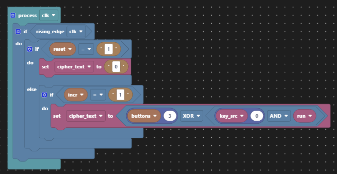

All that we need to do to unencrypt the cipher text is regenerate the key material at the receiving end and keep the key material synchronised with the cipher text. _Easy!?_

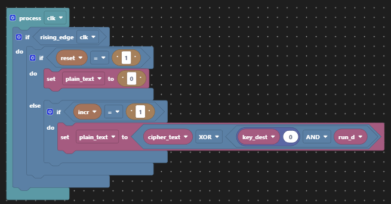

Also for demonstration purposes, we'll provide the means to turn encryption on and off so that it is obvious what the effect of the key material is when the encryption is turned on. The LEDs will be used to display the sequence of `0`s an `1`s later.

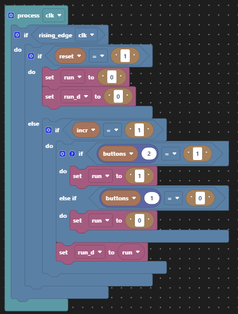

For our key material generator, we'll take some cryptographic short cuts for reasons of accessibility. We'll use a [pseudo random number generator](https://en.wikipedia.org/wiki/Cryptographically_secure_pseudorandom_number_generator) for which we already have two implementations from the [linear feedback shift register](lfsr.md) (LFSR). There is a [justification for this](https://en.wikipedia.org/wiki/Stream_cipher#Based_on_linear-feedback_shift_registers) based on Wikipedia. Here we've chosen the internal feedback implementation for no particular reason. Having only 4-bits of _entropy_ (less given we can only use 15 of the maximum 24 values) this is not cryptographically secure by any means. There is plenty of scope for [increasing the size of the LFSR](https://en.wikipedia.org/wiki/Linear-feedback_shift_register#Example_polynomials_for_maximal_LFSRs) with wider polynomials in order to increase the periodicity of any repeating pattern since we only need to tap one bit of its output. Having generated the pseudo random sequence of 4-bit values, we then take only the bottom bit of each value in the sequence for the key material, because we only need one bit to feed the XOR gate.

An example of a (bad) key implementation here might be to reset the LFSR to a different starting value in each LFRS instance. Then the generated key material sequence would start in a different place for each choice of key. This is bad for two reasons:

1. There are only 15 possible keys in this implementation.
2. The sequence is just rotated, not completely shuffled, for each different key.

There is no sensible means of specifying a key with only 4 buttons in our design, hance no means of changing the key has been included.

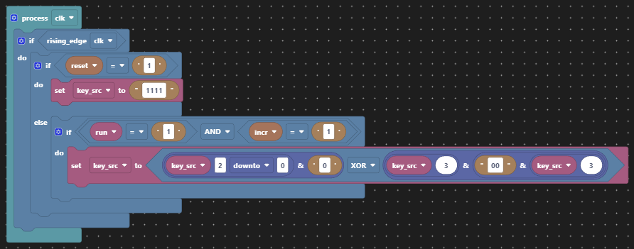

This video demonstates a pseudo-random sequence generated by [one of the demonstrations](lfsr.md).

<video width="100%" controls style="max-width:500px">
  <source src="./images/lfsr_internal.mp4" type="video/mp4">
</video>

The same key material generator is used on receipt, now running out of phase with the original, but hopefully in phase with the encrypted message. Rather than re-use the original sequence for encryption, this regeneration is realistic of a real world implementation since one must not transmit the key material itself as it could then be used by an eavesdropper to decrypt the cipher text. That would provide no privacy at all!

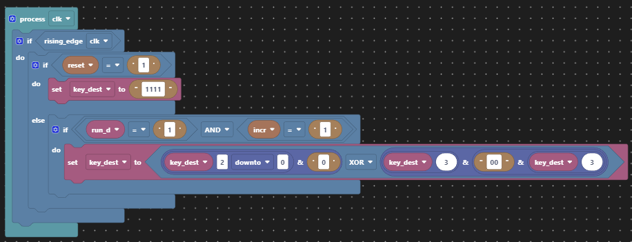

Then in order to demonstrate what is going on we provide status via four LEDs.

| LED | Purpose                         |
|-----|---------------------------------|
|  3  | Original message (plain text)   |
|  2  | Encryption enabled              |
|  1  | Encrypted message (cipher text) |
|  0  | Decrypted message (plain text)  |

| Button | Purpose           |
|--------|-------------------|
|    3   | Message creation  |
|    2   | Encryption enable |
|    1   | Unused            |
|    0   | Unused            |

Using `button(3)` to generate a message, or sequence of `0`s and `1`s, displayed via `led(3)`, one time increment later the cipher text is created and displayed on `led(1)`, and then one more time increment and the decrypted message is displayed on `led(0)`. `button(2)` is used to enable encryption and its current status is displayed in `led(2)`.

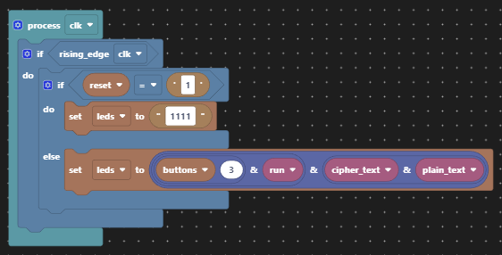

## Scratch VHDL Code Structure

For this example we have broken out of the "single clocked `process` is sufficient" coding style in order to separate out the different functionality into describe-able sections. Not least because we want the illusion of two separate ends of the message transmission link in spite of having both co-located on a single FPGA board. The code would work perfectly fine if grouped into a single process. Once designs start to grow, the single `process` style is less helpful. The Scratch VHDL editor is able to cope with multiple `process`es.

## Application Controls

The controls have been annotated in the picture below. Creating a message with the push button is more interactive than a toggle button. The 'encryption enable' is best achieved with a toggle button so it can be left in one position. As all buttons are wired up in pairs, you can choose to operate the application differently.

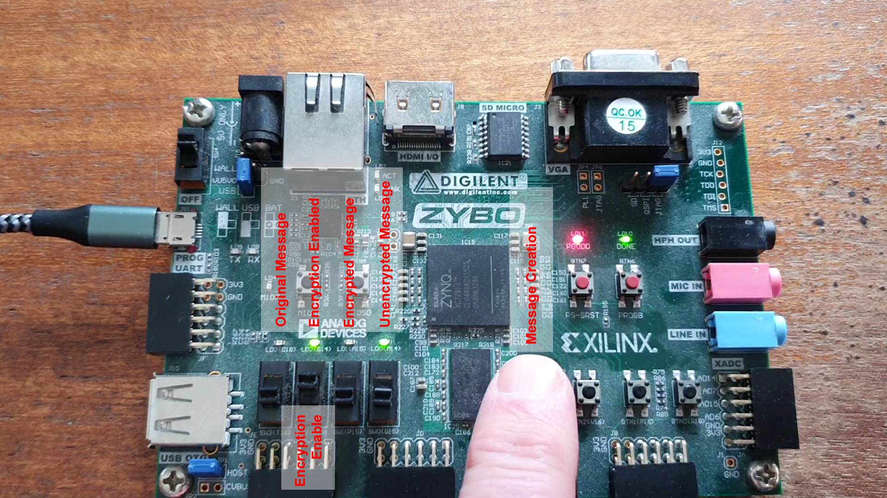

## Video Demonstration

The video below shows the operation of the "Crypto" application. Firstly without encryption, and then with.

Without encryption you see `led(3)` (original message) propagates to `led(1)` and then `led(0)` which each time increment. When toggle `button(2)` is changed, you see `led(1)` (encrypted message) no longer mirrors `led(3)` (original message). `led(0)` (decrypted message) shows the successful decryption of `led(1)`. Note that `led(1)`(encrypted message) changes even when the original message does not, and decryption still returns the original message faithfully.

<video width="100%" controls style="max-width:500px">
  <source src="./images/crypto1.mp4" type="video/mp4">
</video>

## Limits of this "Crypto" application

As already mentioned, this demonstration is limited by comparison with a real cryptographic product. Here are some of the limits:

1. Both ends of the communication line are co-located on the same FPGA board. Typically the encrypted message would be transmitted between locations, e.g. over the air.
2. There is no provision to enter a _[key](https://en.wikipedia.org/wiki/Key_(cryptography))_ and change the way the sequence of `0`s and `1`s is generated for the key material feeding the XOR gates.
3. The key material generator needs to have much more '[entropy](https://en.wikipedia.org/wiki/Entropy_%28computing%29)' (or for the really keen see this [reference](https://en.wikipedia.org/wiki/Entropy_(information_theory))), meaning a bigger pool of randomness to extract the key sequence from.
4. The encryption scheme suffers from a weakness known as [depth](https://en.wikipedia.org/wiki/Cryptanalysis#Depth), as we are sending two or more messages with the same key.
5. Synchronisation is provided by a net across the transmission line where the message is encrypted. This is unrealistic, so what alternatives might be used? E.g. start of message, but that's not helpful in a continuous data stream. Or derivation of the key material from a source known at both ends, e.g. the cipher text? That is known as a [self-synchronizing stream cipher](https://en.wikipedia.org/wiki/Stream_cipher#Self-synchronizing_stream_ciphers).
6. The ability to turn off encryption represents a risk where user error is concerned.
7. There is no attempt to maintain [separation of encrypted and unencrypted paths](https://en.wikipedia.org/wiki/Red/black_concept) to prevent any shorts causing compromise.

So all told, this crypto is pretty terrible.

## Elaboration of Crypto 1 with Vivado

The elaborated design below has been coloured to show key aspects of the realised design.

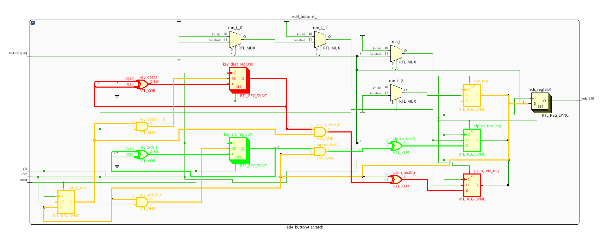

| Colour                                   | Significance      |
|------------------------------------------|-------------------|
| Green   | Encryption path   |
| Red       | Decryption path   |
| Orange | Encryption enable |

The two key generators are `key_src_reg` and `key_dest_reg` since Vivado adds `_reg` to all registers. XOR gates are also used by the two LFSRs.

## Simple Improvement

Let's remove the LFSR and replace it with something that achieves a [self-synchronizing stream cipher](https://en.wikipedia.org/wiki/Stream_cipher#Self-synchronizing_stream_ciphers) and make provision for a key, even if it is limited by being fixed at compile time in a constant. Here we'll keep a record of the last _n_ bits of cipher text transmitted in a shift register and combine those bits with an _n_-bit key to create a single bit of key material, this will be our "[codebook](https://en.wikipedia.org/wiki/Codebook)". We'll also use an additional button which can be pressed to simulate a bit error in transmission and hence mess up decryption on receipt.

| Button | Purpose                |
|--------|------------------------|
|    3   | Message creation       |
|    2   | Encryption enable      |
|    1   | Unused                 |
|    0   | Transmission bit error |

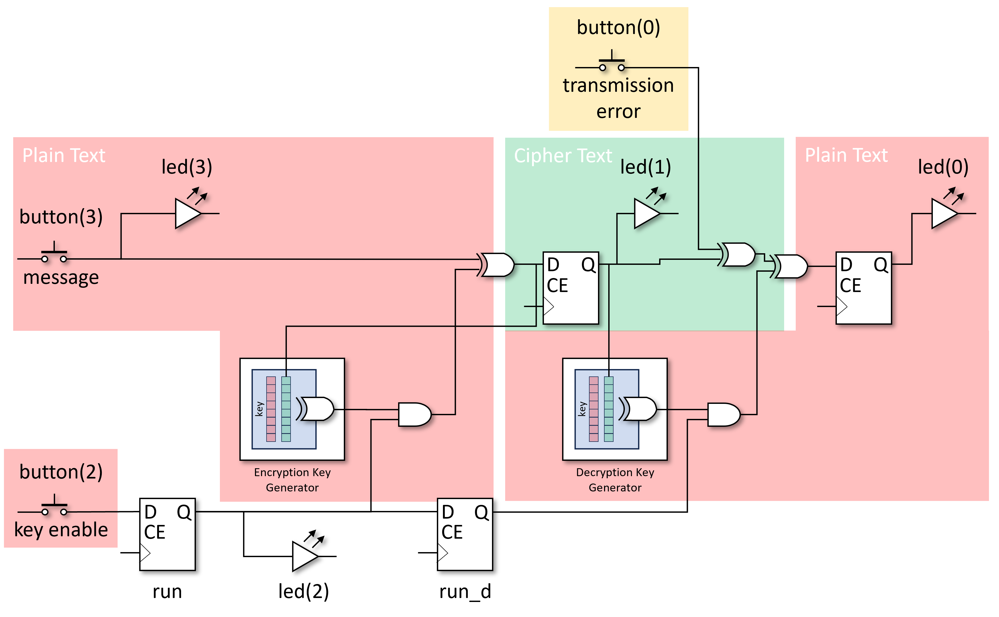

We'll choose _n_=8 just to show that we are not limited to 4-bits all the time. In the absence of any decent cryptographic knowledge, we'll XOR the vector of the last 8 bits of cipher text with the 8 bit key vector to give an 8 bit intermediate result, and then XOR together that 8-bit result down to a single bit of key material. In this way, each bit of key decides if the contribution of the respective bit of cipher text is inverted or not.

This solution for the [codebook](https://en.wikipedia.org/wiki/Codebook) is not great because there are long sequences where the key material does not change. Perhaps some combination of LFSR and cipher text history would solve that, but ultimately the knowledge of how to make a strong cryptographic product is very specialised and beyond the scope of this simple example.

## Parts for Crypto 2

The [self-synchronizing stream cipher](https://en.wikipedia.org/wiki/Stream_cipher#Self-synchronizing_stream_ciphers) needs to retain the cipher text history at both ends from which to derive the decryption key. Here we choose to retain the last 8 bits of the cipher text in a shift register.

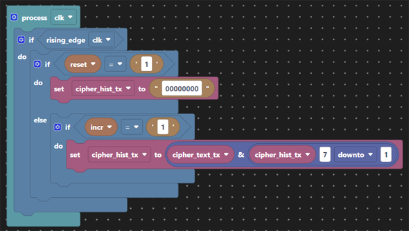

We then create our key material from the crypto key and the cipher text history. In the absence of what makes a good [codebook](https://en.wikipedia.org/wiki/Codebook) this is a simple XOR of 8 bits of key with 8 bits of cipher text history. The codebook used here is nothing special and the key each end is coded as a `constant` and hence fixed at compile time (i.e. not great!). Now we've generated our key material we XOR it with the plain text as before. The cipher text history and the key replaces the LFSR we had in Crypto 1.

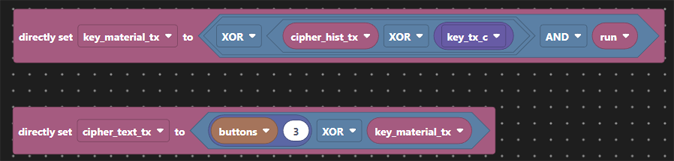

We've implemented the ability to flip bits during transmission in order to simulate transmission errors. The aim here is to show how decryption is briefly affected but recovers after no more than 8 bits, the length of the cipher text history used in our codebook.

On receipt of the cipher text, first that has to be buffered in order to generate the key material.

Then the same codebook applied to generate the key material so that the cipher text can be XOR'ed back to plain text.

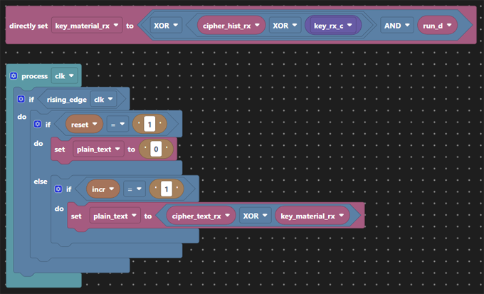

Finally we've retained the controls to turn encryption on and off for this demonstration and the LED display.

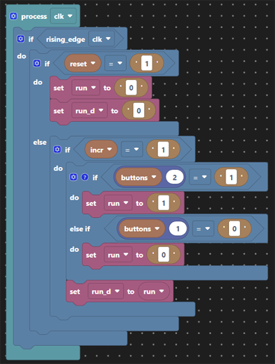
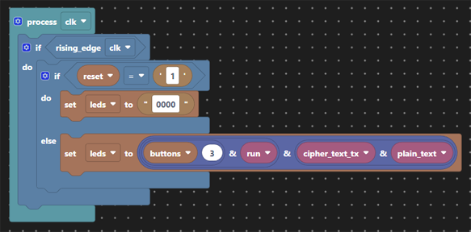

This design having a fixed key unless recompiled means that we still suffer from crypt analytic attacks exploiting '[depth](https://en.wikipedia.org/wiki/Cryptanalysis#Depth)', but has more entropy (8-bits of cipher text). The cryptographic qualities of this code remain dubious at best, but allow for some exploration and experimentation in the application code.

## Elaboration of Crypto 2 with Vivado

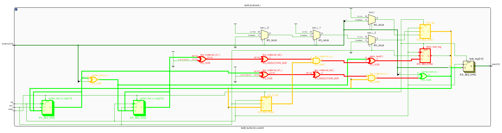

| Colour                                   | Significance                                       |
|------------------------------------------|----------------------------------------------------|
| Green   | Encryption path                                    |
| Red       | Decryption path                                    |
| Orange | Encryption enable and transmission error injection |

The cipher text parts are coloured green, the plain text parts red. Both cipher text histories are green representing they are 'safe' as they are encrypted, but the codebook creating the key material each end are red since they provide the means to decrypt the cipher text. The yellow parts are the encryption enable logic as before and this time the insertion of transmission errors via an XOR gate.
