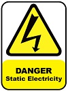

# Development Board

The chosen FPGA development board is a [Zybo Z7](https://digilent.com/reference/programmable-logic/zybo-z7/start) (Zynq-7010 variant). But as the subset of functionality is small, many other boards will be suitable too, for the sake of modifying the outer level VHDL.

Setup is as simple as:

* Plug the board in to a USB socket via the Micro USB socket just below the power switch. Zybo's documentation says this is J12, but it was J11 on our board. (Scary moment...)

Place the board somewhere accessible so that the LEDs can be seen and the 4 push buttons and 4 toggle switches can be changed. You can see the toggle switches bottom left and then to their right the four black push buttons. The LEDs are placed one each above the toggle switches. We do not (yet) use the other facilities on the board such as audio, visual (HDMI), USB sockets or external (no-USB) power sorce.

Take care to use Anti-static precautions that prevent the board being damaged by a minor static shock.
