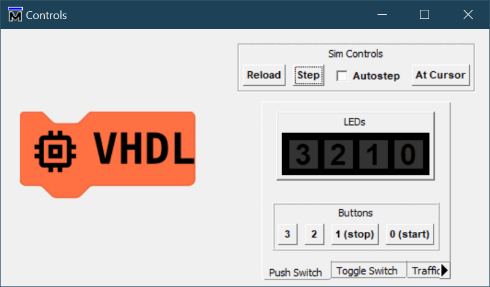

# Dimmer Control

This is not provided as a demo with a solution as it is sufficiently similar to other ideas presented, but different enough that it might be of interest for someone to try. Consider a room light dimmer control that can be incremented and decremented in brightness.

Choose two buttons for `up` and `down` functions to manually advance through states. This example has two immediately obvious implementations.

1. Use an integer counter in the range 0 to 4 and add or subtract 1 for each change. Make sure the actions on values of 0 and 4 are constrained.
2. Use a state machine like the following to explicitly enumerate each state.

stateDiagram-v2
    [*] --> 0
    0 --> 1 : up   = '1' and incr = '1'
    1 --> 0 : down = '1' and incr = '1'
    1 --> 2 : up   = '1' and incr = '1'
    2 --> 1 : down = '1' and incr = '1'
    2 --> 3 : up   = '1' and incr = '1'
    3 --> 2 : down = '1' and incr = '1'
    3 --> 4 : up   = '1' and incr = '1'
    4 --> 3 : down = '1' and incr = '1'

Now we just need to add the output assignments, e.g. using a `case` statement, to decode the state (integer) value to a 4-bit vector assignment to `leds(3:0)`.

| state | `leds(3:0)` |
|:-----:|:-----------:|
|   0   |   "0000"    |
|   1   |   "1000"    |
|   2   |   "1100"    |
|   3   |   "1110"    |
|   4   |   "1111"    |
