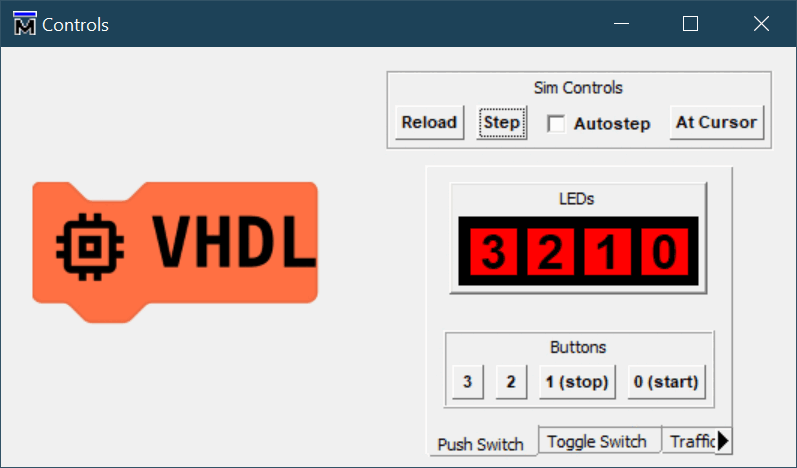
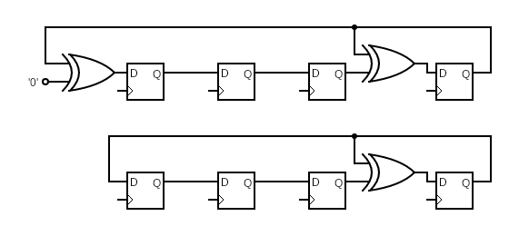

# Linear Feedback Shift Register (LFSR)

Now for something a bit more challenging and mathematical.

In computing, a linear-feedback shift register (LFSR) is a shift register whose input bit is a linear function of its previous state. The initial value of the LFSR is called the seed, and because the operation of the register is deterministic, the stream of values produced by the register is completely determined by its current (or previous) state. Likewise, because the register has a finite number of possible states, it must eventually enter a repeating cycle. However, an LFSR with a well-chosen feedback function can produce a sequence of bits that appears random and has a very long cycle. The mathematics of a cyclic redundancy check, used to provide a quick check against transmission errors, are closely related to those of an LFSR.

Here we implement a 4-bit LFSR using the polynomial:

$$ x^{4}+x^{3}+1 $$

Giving us a sequence that repeats with a period of 15 values. (See [Polynomials for maximal LFSRs](https://en.wikipedia.org/wiki/Linear-feedback_shift_register#Example_polynomials_for_maximal_LFSRs))

References:

1. Wikipedia [Linear-feedback shift register](https://en.wikipedia.org/wiki/Linear-feedback_shift_register)
2. [Linear Feedback Shift Registers (LFSRs)](https://www.eng.auburn.edu/~strouce/class/elec6250/LFSRs.pdf), [Prof. Charles E. Stroud](https://www.eng.auburn.edu/~strouce/), Dept. of Electrical & Computer Engineering, Auburn University, Alabama, USA

## External Feedback

Here the registers are shown reversed from the actual implementation. The first D input is $1$, The first Q output and the second D input is $x$, and so on for $x^{2}$, $x^{3}$, with $x^{4}$ being the final Q output. Feedback via the EOR gate comes from the terms $x^{3}$ and $x^{4}$. This is how the polynomial $(1+x^{3}+x^{4})$ is realised.

## Internal Feedback

The polynomial terms are numbered as for the external feedback LFSR. A pointless EOR gate is shown on the left to explain how the polynomial $(1+x^{3}+x^{4})$ is realised. As _A_ EOR _0 = A_, the EOR gate can be minimised away leaving the second simpler circuit underneath.

## Difference in Sequence

|  # | External | Internal |
|:--:|:--------:|:--------:|
|  0 |   1111   |   1111   |
|  1 |   1110   |   0111   |
|  2 |   1100   |   1110   |
|  3 |   1000   |   0101   |
|  4 |   0001   |   1010   |
|  5 |   0010   |   1101   |
|  6 |   0100   |   0011   |
|  7 |   1001   |   0110   |
|  8 |   0011   |   1100   |
|  9 |   0110   |   0001   |
| 10 |   1101   |   0010   |
| 11 |   1010   |   0100   |
| 12 |   0101   |   1000   |
| 13 |   1011   |   1001   |
| 14 |   0111   |   1011   |
|  0 |   1111   |   1111   |

## Why?

Applications of LFSRs include generating [pseudo-random numbers](https://en.wikipedia.org/wiki/Pseudorandomness), [pseudo-noise sequences](https://en.wikipedia.org/wiki/Pseudorandom_noise), fast digital counters, and [whitening sequences](https://en.wikipedia.org/wiki/Scrambler).

### Counters

Instead of using a binary adder, which suffers from a long carry chain, these circuit can make counters without the carry chain, and hence can count to large values without degrading the maximum clock speed attainable.

Here the difference between internal and external LFSRs comes to light. As the number of bits in the counter grows, the polynomial can have a larger number of terms. With external feedback, extra EOR gates are placed in series between the same to registers. With internal feedback, the extra EOR gates are placed individually between the counting bits, either 0 or 1 deep. Hence the clock speed does not degrade when counting large values.

### Pseudo-Random Numbers

Algorithms can not do random, they have to be deterministic. Computers therefore have never had random numbers in their maths libraries, only things that appear to be. More recently computers have been given external source of 'entropy' in order to really be random. Before that we used LFSRs.

More typically created with larger, e.g. 32-bit, LFSR to give long sequences of e.g. $2^{31}-1$ different numbers. The sequence can appear to be random to a human. As the register can be seeded by any number (except zero), the sequence can be made to start at an arbitrary offset. Now we have a pseudo random sequence of numbers to use in place of random for activities like testing. Importantly for testing, these sequences are reproducible given the same generator and seed, hence it is possible to 'debug' the implementation.

### Noise

Once you have a [pseudo-noise sequences](https://en.wikipedia.org/wiki/Pseudorandom_noise), it can be used for generating noise, e.g. '[white noise](https://en.wikipedia.org/wiki/White_noise)'.