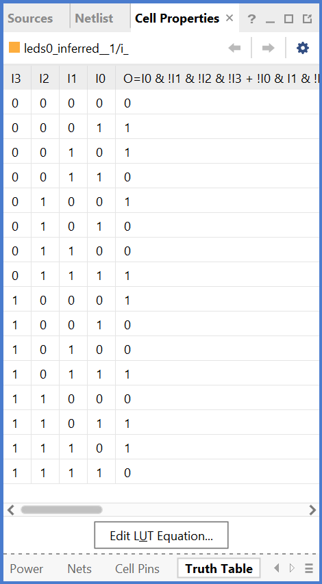

# Logic Gates

Compare the workings of up to four standard logic gates. Each LED is the output of a single 4-input logic gate, allowing up to four functions to be tried, one for each LED. The obvious gates to try first are AND and OR. After that the demo chose to try Exclusive-OR (XOR or EOR) as its quite different, and complete the family with NOR.

The discussion can start with writing out the tables for 2-input gates as follows:

<table style="margin-inline:auto;text-align:center;">
    <tr><th colspan="2">Inputs</th>  <th colspan="4">Outputs</th></tr>
    <tr><th>A</th> <th>B</th>        <th>AND</th> <th>OR</th> <th>XOR</th> <th>NOR</th></tr>
    <tr><td>0</td> <td>0</td>         <td>0</td>  <td>0</td>   <td>0</td>   <td>1</td> </tr>
    <tr><td>0</td> <td>1</td>         <td>0</td>  <td>1</td>   <td>1</td>   <td>0</td> </tr>
    <tr><td>1</td> <td>0</td>         <td>0</td>  <td>1</td>   <td>1</td>   <td>0</td> </tr>
    <tr><td>1</td> <td>1</td>         <td>1</td>  <td>1</td>   <td>0</td>   <td>0</td> </tr>
</table>

Vivado then shows the elaborated design with the easily identified symbols.

The synthesised design is where they are mapped into the FPGA device's primitives gates, usually LUTs, and checking the cell properties of each of the LUTs allows examination of the truth tables to confirm the correct implementation by the tool.

As an example, above is the truth tables for 4-input gates for the student to see the pattern extended. There's a conversation to be had about how the XOR gate extends.
