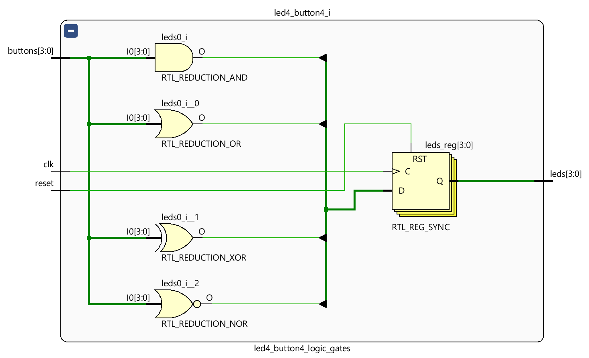
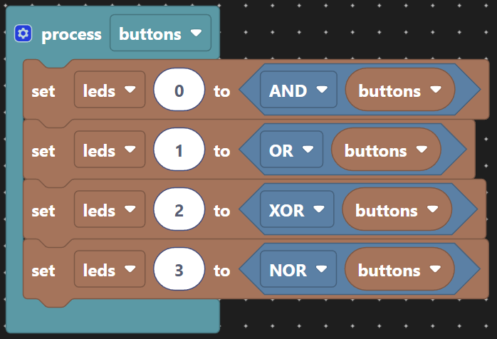
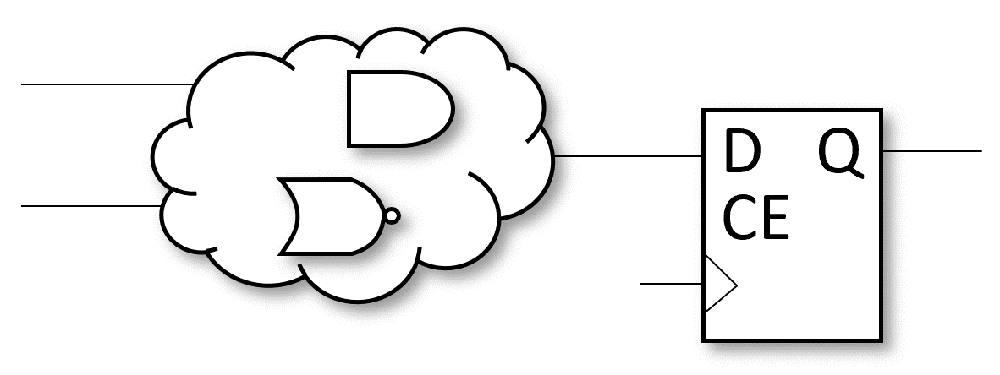

# Logic Gates

Compare the workings of up to four standard logic gates. Each LED is the output of a single 4-input logic gate, allowing up to four functions to be tried, one for each LED. The obvious gates to try first are AND and OR. After that the demo chose to try Exclusive-OR (XOR or EOR) as its quite different, and complete the family with NOR.

The discussion can start with writing out the tables for 2-input gates as follows:

<table style="margin-inline:auto;text-align:center;">
    <tr><th colspan="2">Inputs</th>  <th colspan="4">Outputs</th></tr>
    <tr><th>A</th> <th>B</th>        <th>AND</th> <th>OR</th> <th>XOR</th> <th>NOR</th></tr>
    <tr><td>0</td> <td>0</td>         <td>0</td>  <td>0</td>   <td>0</td>   <td>1</td> </tr>
    <tr><td>0</td> <td>1</td>         <td>0</td>  <td>1</td>   <td>1</td>   <td>0</td> </tr>
    <tr><td>1</td> <td>0</td>         <td>0</td>  <td>1</td>   <td>1</td>   <td>0</td> </tr>
    <tr><td>1</td> <td>1</td>         <td>1</td>  <td>1</td>   <td>0</td>   <td>0</td> </tr>
</table>

Vivado then shows the elaborated design with the easily identified symbols.

The synthesised design is where they are mapped into the FPGA device's primitives gates, usually LUTs, and checking the cell properties of each of the LUTs allows examination of the truth tables to confirm the correct implementation by the tool.

As an example, above is the truth tables for 4-input gates for the student to see the pattern extended. There's a conversation to be had about how the XOR gate extends.

## Implementation

The simplest implementation is a purely combinatorial circuit.

Which produces this VHDL:

<pre>
<code class="language-vhdl">
architecture scratch of logic_gates is
begin

  process(leds)
  begin
    leds(0) <= and(buttons);
    leds(1) <= or(buttons);
    leds(2) <= xor(buttons);
    leds(3) <= nor(buttons);
  end process;

end architecture;
</code>
</pre>

And Has the following form of logic. Now we're introducing the _logic cloud_ as a short hand for any combinatorial logic that we can not be bothered to realise manually. This is mainly due to the fact the synthesis tool does that work for us and we do not usually need to care until we have a problem to fix.

Typically we do not like _unregistered_ outputs as this does not aid with meeting timing for a required clock speed. A concept we will leave unexplained for now.

Which produces this VHDL:

<pre>
<code class="language-vhdl">
architecture scratch of logic_gates is
begin

  process(clk)
  begin
    if rising_edge(clk) then
      if reset = '1' then
        leds <= "0000";
      else
        leds(0) <= and(buttons);
        leds(1) <= or(buttons);
        leds(2) <= xor(buttons);
        leds(3) <= nor(buttons);
      end if;
    end if;
  end process;

end architecture;
</code>
</pre>

The above change to Scratch now gives us a form of logic that follows. A logic cloud feeding a register, or in this case four different registers `leds(3:0)`.

