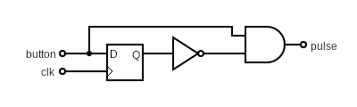
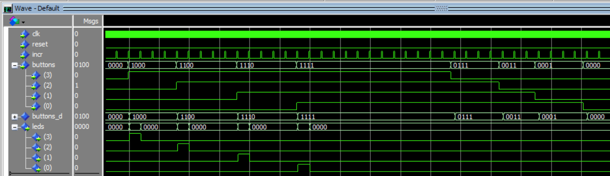

# Pulse Generator

Create a short pulse from a longer one. Here each LED is only briefly lit however long the button is pressed. This is a basic and standard technique in digital design.

This basic principle is shown above, where the output is high when the in put is except if the register output is high, which occurs one clock cycle later. i.e. We have a pulse generated off the leading edge of `button`. The sequence of states in condensed time is shown in the following truth table.

| buttons | Q   | pulse |
|:-------:|:---:|:-----:|
| 0       | 0   | 0     |
| 1       | 0   | 1     |
| 1       | 1   | 0     |
| 0       | 1   | 0     |
| 0       | 0   | 0     |

From this we can determine that:

`pulse` = `buttons` AND NOT `Q`

This principle can be extended to several clock cycles by including a condition on a heart beat pulse like `incr`.

Each pulse on `leds(3:0)` shown here is the length of the gap between adjacent pulses on `incr`, just long enough to make an LED flash.
