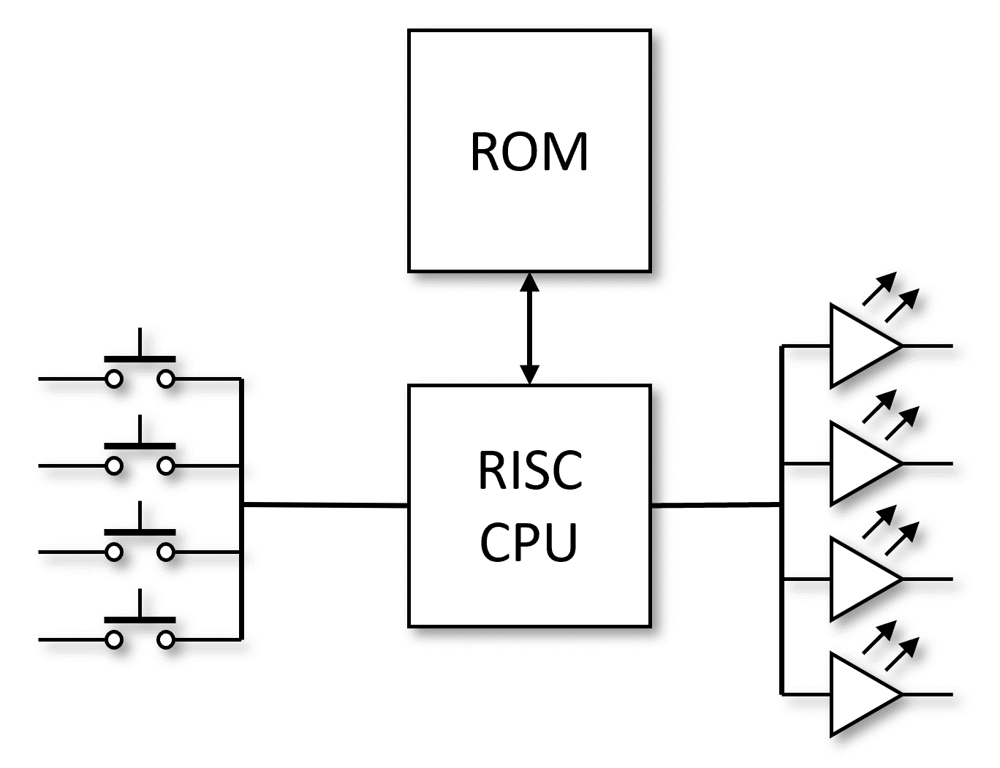
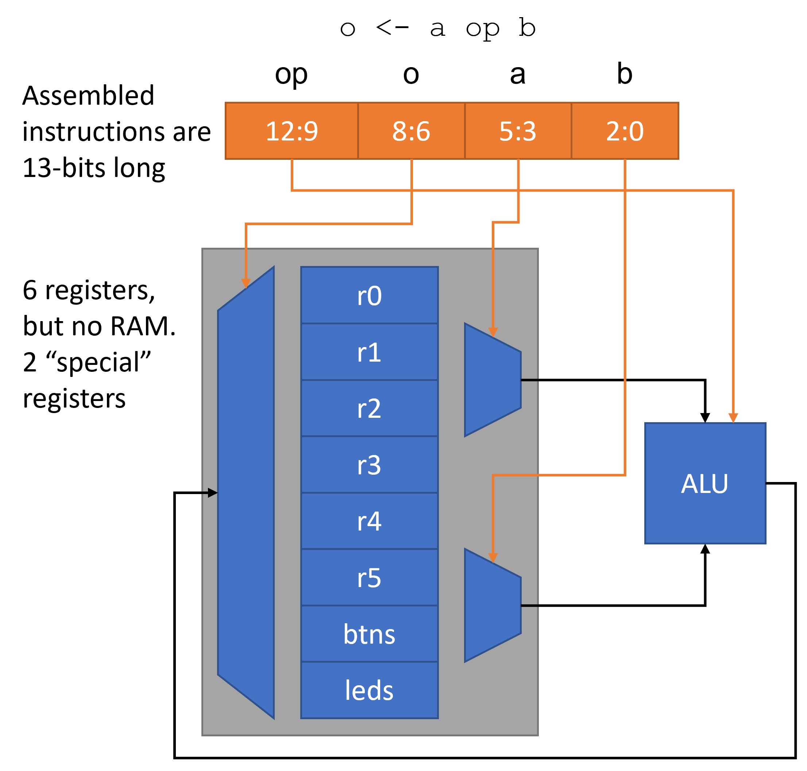
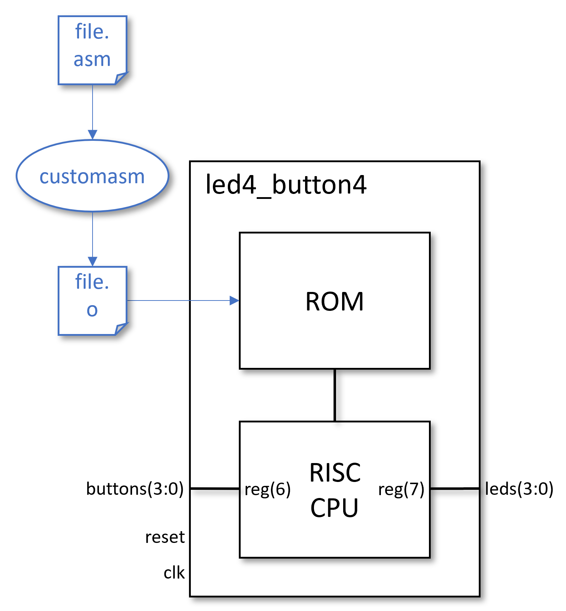

# RISC CPU

_Reduced Instruction Set Computer_ (RISC) _Central Processing Unit_ (CPU)

How about a 4-bit CPU? That gives the opportunity to define 16 instructions, and we can simplify the architecture so the code is stored in a ROM at compile time. You can choose how many registers you code and how the buttons and LEDs are read or driven respectively. All of this functionality neatly fits within the same `led4_button4` definition.

For the sake of simplicity, we're proposing the use of a Read Only memory (ROM) over a Random Access Memory (RAM).

## Candidate Instructions

* `NOOP` - No operation, does nothing and is more useful than you might think.
* `LOAD` a register with a literal (actual value)
* `ADD` two registers and place the answer in a register
* `SUB`tract
* `AND` - Vector based, i.e. "1001" AND "0011" = "0001"
* `OR` - Vector based
* `NOT` - Vector based
* `IF_BIT` - If register bit set
* `IF_EQ` - If equal
* `IF_GT` - If greater than
* `IF_GE` - If greater than or equal
* `IF_LT` - If less than. Note you don't need this if you have `LT_GE` as you can just swap the operands over.
* `IF_LE` - If less than or equal to. Note you don't need this if you have `LT_GT` as you can just swap the operands over.
* `GOTO` an instruction. This requires some care with program counter values that may get shifted by code changes. At this point you need to start using loop labels with an assembler.
* `WAIT` - Wait for a specified number of pulses on the `incr` input

You will need to design the instruction set that operates on 0, 1 or 2 operands. You will need to consider how to format the assembled instructions so that the logic to implement them is thought out and minimal, and where the result gets written. You could write the answer to a third specified register, or use one of the two operands registers and perform an update in place.

You will need to pack your instructions into words to be stored in memory. For example, you might choose to pack your instructions like the following. 4-bit registers, but the values packed into the instructions are not the contents of the registers but the references to the internal registers. So if you have 8 registers, you will need 3 bits to reference them, only 2 bits if you have 4 internal registers.

Here's an example of an assembled instruction for `ADD` taking two inputs and writing one output, e.g. `A` = `B` `AND` `C`.

|      | Instruction | Operand 1 | Operand 2 | Result |
|:----:|:-----------:|:---------:|:---------:|:------:|
| Bits |      4      |     3     |     3     |    3   |

If you change one of the operands in place, e.g. `A` = `A` `AND` `B`, you can reduce the word size.

|      | Instruction | Operand 1 | Operand 2 |
|:----:|:-----------:|:---------:|:---------:|
| Bits |      4      |     3     |     3     |

But you will need to be able to specify 4-bit literals in the `LOAD` operation. So you might need a different format for that particular case:

|      | Instruction | Literal   | Packing |
|:----:|:-----------:|:---------:|:-------:|
| Bits |      4      |     4     |   `0`s  |

Then a `GOTO` will require an operand for the jump to another programme counter. The program counter needs to have as many bits as there are address lines to the ROM.

Finally, all instructions must assemble to the same number of bits in a word, so there might be some unused bits that just need some value, e.g. `0`. This is because you are writing these resulting bit vectors into a sequence of addresses in a ROM, so the length of each vector must be the same number of bits.

## Assembler Definition

For this part of the project we suggest you use [customasm](https://github.com/JosephAbbey/customasm). The link here is to a fork of the original which has been extended for portability and re-use. The original repository provides the [documentation](https://github.com/hlorenzi/customasm/wiki/Getting-started). Here you will need to describe the mnemonics used for your assembly language and how the instructions and operands pack into the bit vectors to be stored in the ROM. 'customasm' provides a language or configuration method to describe how to parse the mnemonics and convert them to a sequence of bits (packing) for your custom microprocessor. It then provides a bundle of utilities that you might expect to be available when writing assembly language.

* Labels for `GOTO` instructions. The labels get converter to program counter values for the jump required in the address lines to the ROM
* Constants that enable you to define bit offsets, e.g. `btn1 = 0b0010`.
* Functions - but now we're getting more complicated than a 4-bit CPU can really make use of.

All of this can be made available either through

* A web-based editor as customised for this project in `bin/customasm.html`. This is setup when [`fetch_bin.cmd`](https://github.com/house-of-abbey/scratch_vhdl/blob/main/fetch_bin.cmd) is executed so can not be linked here. Or,
* A command line tool to [compile a file of assembly](https://github.com/house-of-abbey/scratch_vhdl/blob/main/design/asm_compile.cmd) code to instructions in a text file that can be read by a ROM initialisation routine in VHDL. Very useful for build scripts.
## Demonstration RISC CPU

The demonstration RISC CPU comes with an [example instruction set definition](https://github.com/house-of-abbey/scratch_vhdl/blob/main/design/demos/asm/ruledef.asm) to give you some ideas and an example to follow. This CPU has 8 internal registers (in lieu of zero RAM!), of which register 6 is bound to the buttons (and hence is read only) and register 7 is bound to the LEDs. Use the link to see the most up to date version. The `#ruledef` section covers the list of instructions and the `#subruledef reg` section constrains the register selections for use in the instructions. An additional `#subruledef sreg` prevents `r6` being used for an assignment as its the 'read-only' `btns` (VHDL `buttons`) input in the demonstration implementation.

<pre>
#once
#bits 13

; Define a register
#subruledef reg
{
  btns    => 6`3 ; equivalent to r6
  leds    => 7`3 ; equivalent to r7
  r{r:u3} => r`3
}

; Safely assign the output register, make sure it is not r6, which is
; read-only for the buttons inputs.
#subruledef sreg
{
  {o:reg} => {
    assert(o != 6)
    o`3
  }
}

#subruledef condition               ;      VHDL references
{                                   ;  op @ dest @ src1 @ src2
  {a:reg}[{b:u2}]                  => 0xa @  0`3 @  a`3 @  0`1 @ b`2 ; op_ifbit
  {a:reg} eq {b:reg}               => 0xb @  0`3 @  a`3 @  b`3       ; op_ifeq
  {a:reg} gt {b:reg}               => 0xc @  0`3 @  a`3 @  b`3       ; op_ifgt
  {a:reg} ge {b:reg}               => 0xd @  0`3 @  a`3 @  b`3       ; op_ifge

  {a:reg} lt {b:reg}               => asm { {b} ge {a} }
  {a:reg} le {b:reg}               => asm { {b} gt {a} }
}

; In general: o = fn(a, b)
;
#ruledef                            ;      VHDL references
{                                   ;  op @ dest @ src1 @ src2
  noop                             => 0x0 @         0`9              ; noop
  {o:sreg} <- {v:u4}               => 0x1 @  o`3 @  0`2 @  v`4       ; op_set
  {o:sreg} <- {a:reg}              => 0x2 @  o`3 @  a`3 @  0`3       ; op_copy
  {o:sreg} <- {a:reg} and {b:reg}  => 0x3 @  o`3 @  a`3 @  b`3       ; op_and
  {o:sreg} <- {a:reg} or  {b:reg}  => 0x4 @  o`3 @  a`3 @  b`3       ; op_or
  {o:sreg} <- not {a:reg}          => 0x5 @  o`3 @  a`3 @  0`3       ; op_not
  {o:sreg} <- {a:reg}  +  {b:reg}  => 0x6 @  o`3 @  a`3 @  b`3       ; op_add
  {o:sreg} <- {a:reg}  -  {b:reg}  => 0x7 @  o`3 @  a`3 @  b`3       ; op_sub
  {o:sreg} <- {b:u1}   >  {a:reg}  => 0x8 @  o`3 @  a`3 @  0`2 @ b`1 ; op_shft
  {o:sreg} <- {a:reg}  <  {b:u1}   => 0x8 @  o`3 @  a`3 @  1`2 @ b`1 ; op_shft

  {o:sreg} <- {a:reg} nand {b:reg}  => asm {
    {o} <- {a} and {b}
    {o} <- not {o}
  }
  {o:sreg} <- {a:reg} nor {b:reg}  => asm {
    {o} <- {a} or {b}
    {o} <- not {o}
  }
  
  if {c:condition}                 => c`13
  wait until {c:condition} => asm {
    if {c}
      noop
      goto $ - 2
  }
  wait while {c:condition} => asm {
    if {c}
      goto $ - 1
      noop
  }

  wincr                            => 0xe @         1`9              ; op_wi
  wincr {l:u9}                     => 0xe @         l`9              ; op_wi
  wait incr        => asm { wincr }     ; Included as an alias to provide a
  wait incr {l:u9} => asm { wincr {l} } ; more readable and consistent option.

  goto  {l:u9}                     => 0xf @         l`9              ; op_goto

  halt    => asm { goto $ }
  restart => asm { goto 0 }
  clear   => asm {
    r0   <- 0
    r1   <- 0
    r2   <- 0
    r3   <- 0
    r4   <- 0
    r5   <- 0
    btns <- 0
    leds <- 0
  }
}
</pre>

Typically the unassembled instructions would be written into a `file.asm` text file and then assembled into a `file.o` text file. The VHDL test bench will then be passed the path to the text file and initialise the ROM with the contents during synthesis. If the unassembled files are written to `design/demos/asm/`, the the [`fetch_bin.cmd`](https://github.com/house-of-abbey/scratch_vhdl/blob/main/fetch_bin.cmd) script can be re-used for compilation. It calls `customasm` on each file matching `*.asm` in that directory and places each product file in the simulation area under the `instr_files` directory. Both Modelsim and Vivado can pick up the files from that directory.

Unassembled code (`add.asm`), more readable:

<pre>
#include "./ruledef.asm"

r0 <- 3
r1 <- 0b0000

loop:
  leds <- r0 + btns
  wincr 3
  leds <- btns and r1
  wincr 1
  goto loop
</pre>

Assembled code (`add.o`), for the ROM:

<pre>
0001000000011
0001001000000
0110111000110
1110000000011
0011111110001
1110000000001
1111000000010
</pre>

## Demonstration CPU

This project comes with an example RISC processor if you would prefer to jump ahead to the programming in assembly step. Both the Scratch VHDL for the RISC CPU and the assembly of instructions is ready and available for experiments. Perhaps work your way through the existing examples for state machines but this time in assembly code. Again this can be simulated and then downloaded to the development board and executed to prove it works. Take a look in the [ASM examples](../design/demos.asm/) to get started.

In order to execute these files you will need to:

1. Compile the simulation to include the `risc_cpu` architecture of the `led4_button4` component.
2. Supply the simulation tool, ModelSim, with the path to the _compiled_ instructions, i.e. the contents to initialise the ROM with. The TCL function `change_asm {/path/file.o}` restarts the simulation with an amended value for the generic used by the top level of the design.
3. Supply the synthesis tool, Vivado, with the path to the _compiled_ instructions. The TCL function `set_asm_file file` amends the generic used by the top level of the design in Vivado. Then the synthesis will be able to include the instructions in the ROM when generating the `BIT` file.
4. Send the `BIT` file to the development board for execution. This contains both the RISC CPU and the ROM initialised with the assembled code.

These are the actions that you need to use to manage this process:

| Action    | Button | Script      |
|:----------|:------:|:------------|
| Simulation|  | `change_asm {/path/file.o}` |
| Synthesis |  | `set_asm_file file` |

## And Finally

Just pause for a moment and think about what we have done here. All the demonstrations for creating firmware to drive the LEDs can be implemented in one general purpose processor. If the ROM was actually RAM, we would be able to re-programme the LED operations without the synthesis step. But more to the point, software (a collection of assembled instructions) is just one great big finite state machine. It is still 'finite' because the storage space for code in the memory (ROM) is limited. In this case the limit is 29 = 512 states. But the states might not be used as efficiently if multiple instructions are required to achieve what one state in a pure firmware implementation can achieve.

There's a trade here between generality of purpose and optimal calculation. This is a trade that is conventionally driven by economics, the (additional) cost of writing an optimal design in firmware versus the re-usability and flexibility of a single solution that does many things that does not achieve quite the same performance. If you want the highest performance then you'll need to turn to Application Specific Integrated Circuits (ASIC), where the logic is hard coded and sometimes carved and chiselled to perfection. Taking away the reprogrammability of FPGAs leads to greater clock speeds and yet higher performance.

| Feature     | ASIC | FPGA | Software |
|:------------|:----:|:----:|:--------:|
| Flexibility | Low  |  -   | High     |
| Performance | High |  -   | Low      |
| £ Price     | High |  -   | Low      |

FPGAs sit in the middle, with the elements of the reprogrammability of software and the performance of application specific devices. The remaining amusing anecdote is that both microprocessors and FPGAs are themselves ASICs.
