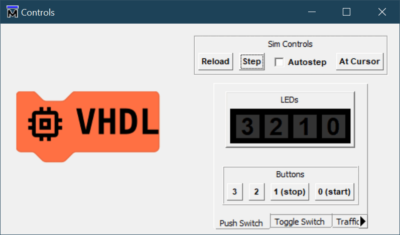

# Shift Registers

This demonstration introduces a time or history element. The initial application uses a key press to send a lit LED down a shift register.

  <iframe
    src="https://circuitverse.org/simulator/embed/shift-register-7ff8c97b-95e9-45cc-8940-ca0d29f24c98?theme=lite-born-spring&display_title=true&clock_time=true&fullscreen=true&zoom_in_out=true"
    style="border-width: 2; border-style: solid; border-color: black;"
    id="sm_buttons"
    height="500"
    width="700"
    allowFullScreen>
  </iframe>

Because a manual key press can be long in duration, a pulse generator is used to limit a derived pulse to no more time than one `incr` duration, when action is taken. Shifting is only enabled when `incr` is high in order to slow the light changes down to be visible.

The extension is more challenging. This uses a second button (button 3) to send a lit LED the opposite way down the shift register, and hence change the shifting direction. Both buttons require pulse generators. Care has been taken to ensure the first press causes a LED to light, not just change shifting direction. There are two ways to code this, a single all in one `if` clause which is complicated, or breaking the logic out into two `if` clauses, one for the general shifting and a second for poking the '1' into the correct end of the shift register. This second formulation relies on understanding how VHDL signals simulate; that the assignments actually occur on the clock edge not before, hence a later assignment can _override_ an earlier one.
