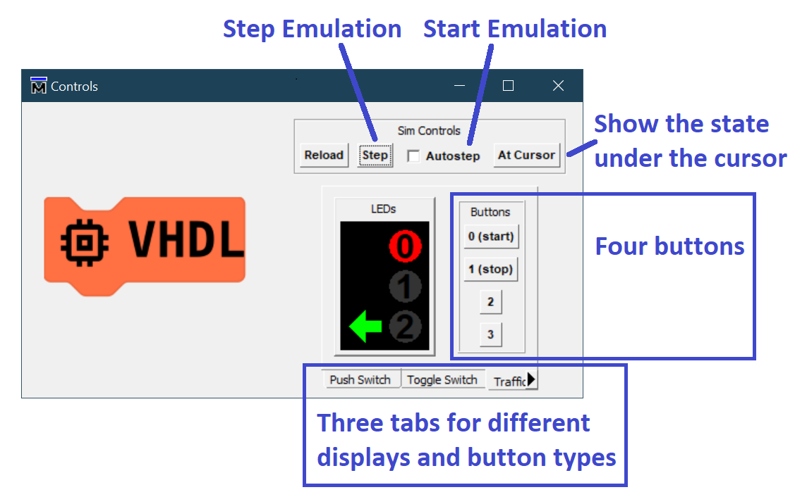
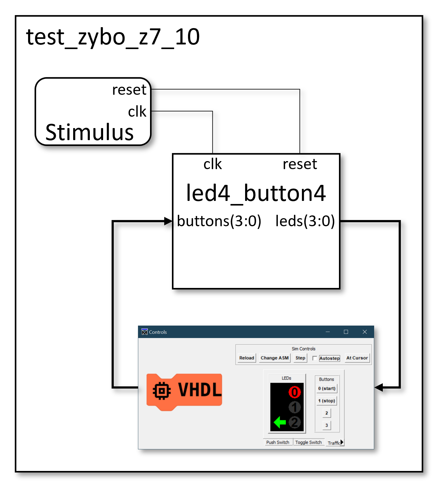
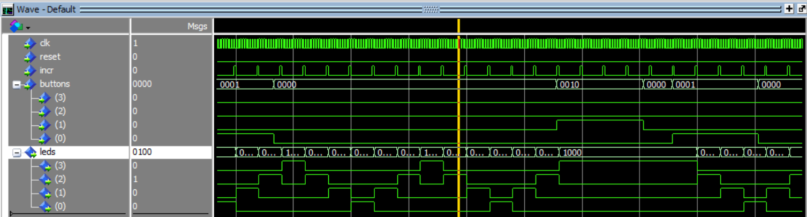

# Simulation

## Controls & Display

We avoid the need to write a VHDL test bench by substituting the stimulus VHDL code with a graphical user interface to control the inputs and display the outputs. In order for this to work it is necessary to start the simulation from the batch file [`run_sim.cmd`](https://github.com/house-of-abbey/scratch_vhdl/blob/main/design/run_sim.cmd), which loads the TCL scripts necessary to make this work.

The controls comprise:

* `Reload` button which will reload the simulation and run a short way from the start until the first pause.
* `Change ASM` button to apply a different compiled assembly file to the code ROM.
* `Step` button which allows single stepping through the simulation. A `step` is defined as the next pulse on the `incr` signal, which is simulation is 10 clock cycles. This allows multiple buttons (inputs) to be pressed at once before continuing the simulation, and to more easily trace the signal waveforms through execution for debugging.
* `Autostep` allows the VHDL simulator to act like an emulator, and the user can keep clicking buttons to see their effect without pressing `Step` each time. Typically a design test starts by turning this on, and finishes by turning this off.
* `At Cursor` causes the display to reflect the LED state under the simulation cursor. This saves having to recall which bits of `leds(3:0)` maps to which LEDs on the display.
* Four buttons for `buttons(3:0)`.
* Four LEDs in various layouts.
* Three tabs to change the layout and colour of the LEDs and the button types (push or toggle) and hence modify the way that the LEDs are interpreted.

## Testing

A test bench is used to provide the clock and reset. After that all the stimulus comes from the graphical controls, and the LED outputs drive the display panel.

This is an alternative to writing VHDL stimulus in the test bench and keeps the test process engaging and interactive at the expense of repeatability. It does therefore skip a realistic step in development of tests.

## Debug

The simulation _Wave_ window must still be used for debugging the wave forms created from the button presses.

