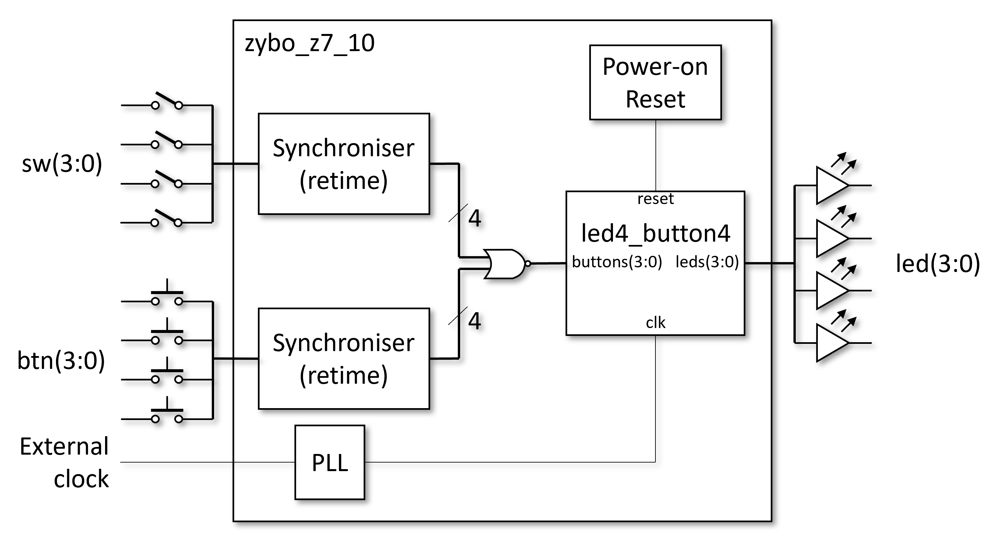
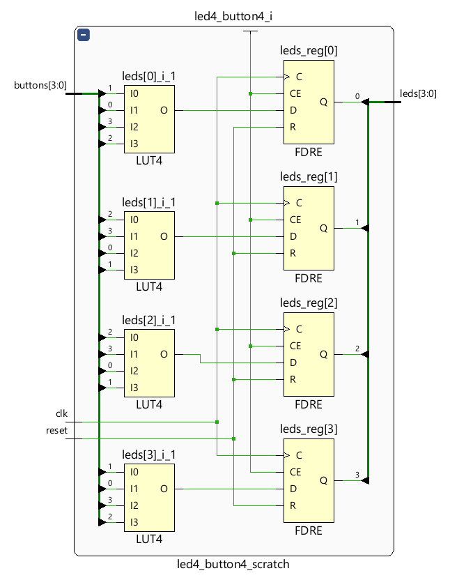
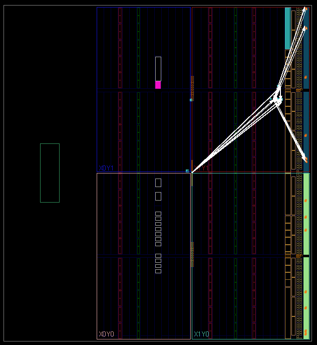

# Synthesis

The process of generating a design from VHDL has been simplified and automated in a way this is customised to this application. We have installed toolbar buttons that run TCL functions from a script. **As long as Vivado is started from the batch file [`run_vivado.cmd`](https://github.com/house-of-abbey/scratch_vhdl/blob/main/design/run_vivado.cmd), the correct TCL script will be read and the design prepared earlier will be loaded.**

The letters 'E', 'S', 'i', 'P' and 'A' on each button refer to the steps detailed below.

## Full Design

Beyond the sub-components we have been simulating there is additional logic used for "house keeping" tasks.

* As the buttons and switches are in effect "asynchronous" to the internal clock they must be "synchronised" to it to avoid meta-stability. This will not be explained further as its a big topic.
* Each button is `OR`'ed with is corresponding switch (toggle button) as a simple way to amalgamate the two stimuli. This means that the toggle buttons need to be returned to their off position when using the push buttons.
* A Phase Locked Loop (PLL) is used for clock management (and avoid hold time violations on `reset`.)
* A "Power on Reset" component is used to generate a short reset after each re-programming of the device. It uses an FPGA's ability to initialise registers to a known value in the `BIT` file and holds the reset high (`1`) until `GSR` (_Global Set/Reset_) goes low after programming and then shifts a `0` through a short shift register soon after lowering `reset`.
* A seven segment display driver was in the box, and it just had to be used. The additional PCB plugs into the development board and provide a pair of displays. It only makes sense for 4-bit to drive a single display. The decoder implements the driving of both displays, and has to switch between them rapidly (faster then 20 ms) to give the illusion that both are continuously driven as there are only 8 connections (7 segments and one display select). The display will decode to hexadecimal for the values in the range 10-15. (See the [binary counter](binary_counter.md) demo for an explanation.)

The Scratch VHDL design simply replaces the contents of the `led4_button4` component each time it is compiled. The rest of the design is trusted and hence not re-simulated each time.

## Elaboration Step

This is managed by the TCL function `elab_my_design`. It elaborates the design to generic gates and opens up the schematic of the sub-section of the design authored through Scratch VHDL.

From this schematic you may select a gate and press `F7` to display the VHDL code that generated the gate.

## Synthesis Step

This is managed by the TCL function `synth_my_design`. It synthesises the design to the technology required for the selected development board (currently a Zybo Z7 board). Synthesis maps the generic gates to the chosen technology and then opens up the schematic of the sub-section of the design authored through Scratch VHDL.

From this schematic you may select a gate and press `F7` to display the VHDL code that generated the gate.

Typically at this stage we will get estimates of timing paths between registers. The figures are based on a model only because without placing the primitives and routing nets between them we have not precision over net delays, only gate delays. Still, the _static timing analysis_ still proves useful in recoding the VHDL for timing closure ahead of more time spend on the next step.

## Implementation Step or "Place and Route"

The product from synthesis is a 'netlist' of gates ready to be placed across the FPGA fabric and nets routed between the gates. This is managed by the TCL function `impl_my_design`. When the implementation step completes, it will open up a the schematic of the sub-section of the design authored through Scratch VHDL.

When selecting the constituents of the `led4_button4` component's gates, the 'Device' tab in Vivado shows which parts of the FPGA's "sea of gates" have been used. As you can see its a very small fraction of the entire FPGA because these designs are not taxing the device's utilisation.

## Programming Step

A `BIT` file of the implemented design is created, which is required to programme the FPGA, and sent over a USB cable to the [development board](development_board.md) for execution on target. This is managed by the TCL function `prog_my_board`.

## Assembly File Selection

Used when selecting the RISC CPU for the `led4_button4` VHDL entity. You can change the assembly code contents compiled into the ROM by choosing a `.o` file compiled from a `.asm` file by [`asm_compile.cmd`](https://github.com/house-of-abbey/scratch_vhdl/blob/main/design/asm_compile.cmd). This is managed by the TCL function `set_asm_file`, and it changes a generic on the top level VHDL entity after verifying the requested file exists.
