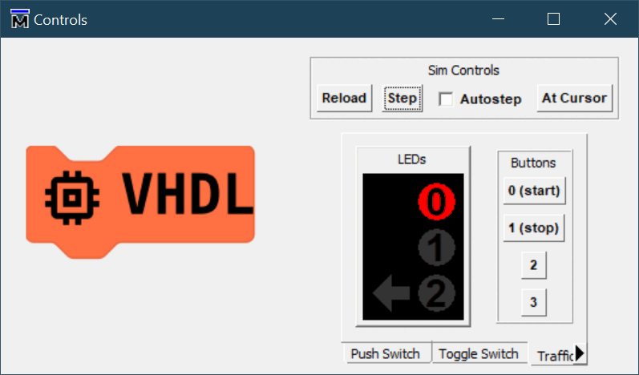

# Traffic Lights

These come in two variations, the standard junction and the Pelican Crossing. An integer is used as the state variable again, but the state machine now uses inputs to intervene in (or control) the linear sequence. The next state to move to is now specified manually rather than by a counter.

We're now getting much closer to a classical [Finite State Machine](https://en.wikipedia.org/wiki/Finite-state_machine).

## Standard Junction

Create the correct pattern of lights for starting and stopping, each operated by a push button.

Reference: [Highway Code](https://www.gov.uk/guidance/the-highway-code/light-signals-controlling-traffic) [[PDF](https://assets.publishing.service.gov.uk/media/560aa3f9e5274a036900001c/the-highway-code-light-signals-controlling-traffic.pdf)]

## Pelican Crossing

Similar to the above, but implement the flashing amber light sequence. Again with `start` and `stop` buttons.

Reference: [Flashing amber traffic lights](https://www.passmefast.co.uk/resources/driving-advice/traffic-light-sequence-guide) (www.passmefast.co.uk)

## Implementation

Both of these are implemented with a finite state machine (FSM) like the [Knight Rider](knight_rider.md) demonstration. This time the `start` input moves away from the red stop light to the green proceed light, and the `stop` input moves away from the green to the red. So this FSM makes use of input buttons to control the progress of the state transitions. The `incr` is included in all transitions and is internally generated.

stateDiagram-v2
    [*] --> 0
    0 --> 1 : start = '1' and incr = '1'
    1 --> 2 : incr = '1'
    2 --> 3 : stop = '1' and incr = '1'
    3 --> 4 : incr = '1'
    4 --> 5 : start = '1' and incr = '1'
    5 --> 6 : incr = '1'
    6 --> 7 : stop = '1' and incr = '1'
    7 --> 0 : incr = '1'

Output decoding based solely on the state variable's value.

| state | `leds(3:0)` | Comment                        |
|:-----:|:-----------:|:-------------------------------|
|   0   |   "0001"    |                                |
|   1   |   "0011"    |                                |
|   2   |   "0100"    |                                |
|   3   |   "0010"    |                                |
|   4   |   "1001"    | Includes the lane filter light |
|   5   |   "0011"    |                                |
|   6   |   "0100"    |                                |
|   7   |   "0010"    |                                |
