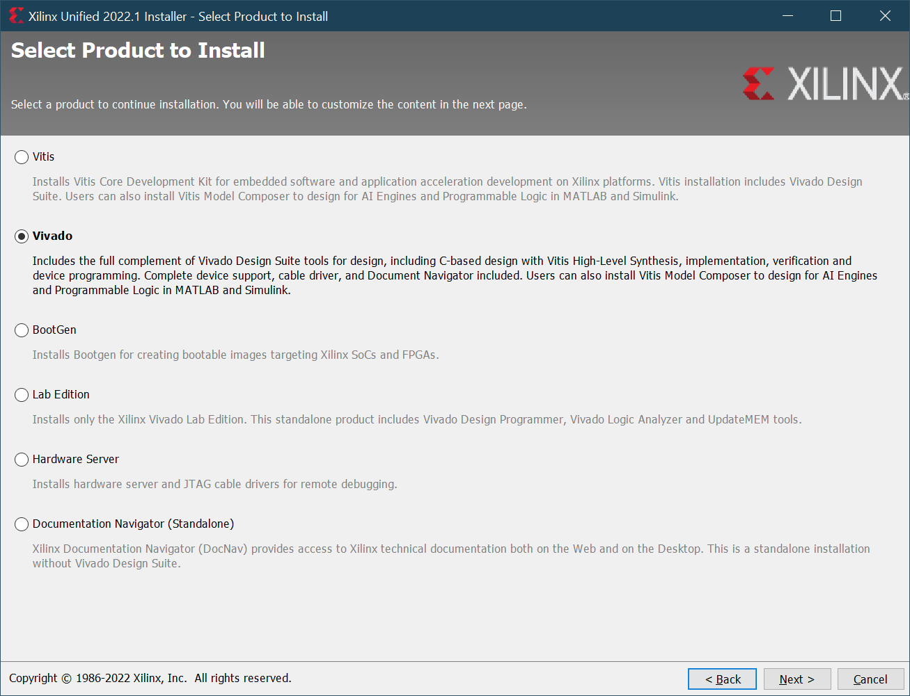
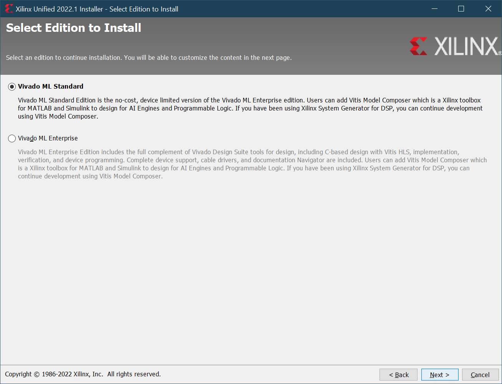
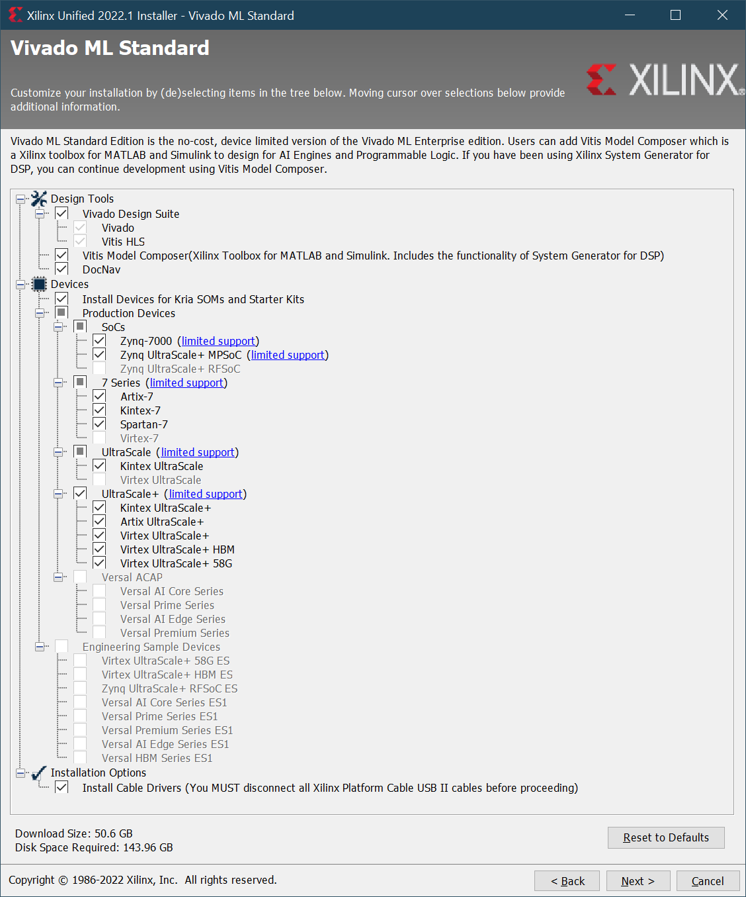

# Vivado Webpack Installation

Download [Vivado ML Edition](https://www.xilinx.com/support/download.html). You can pick up the latest update, and the installation options should be similar to the following screenshots, only updated for more recent versions. Here we select what is required for synthesis of VHDL, we do not include "higher level" design entry methods.

The Webpack is now just the same as Standard et al, only without a license you have fewer devices available. So use the unified installer, and install off the Internet as opposed to downloading the full installer (@ 70GB+). The development board we have used selects a device from within the free subset.